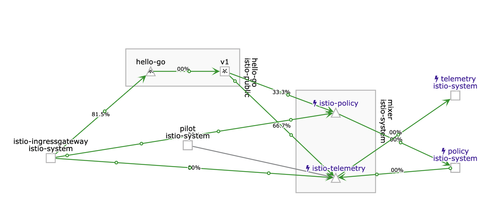
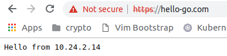

# kubernetes-istio-example

This demos how HTTP/HTTPS routing with Istio gateway/virtual service work using the latest istio sidecar injection system.

You need to install istio CRD then upload the cert whilst following the steps below.



## Dependencies
- `go get github.com/AlexsJones/vortex` _This is optional for interpolation of templates_

## Platform setup

### Google Cloud Platform
```
gcloud container clusters create example-cluster \
--zone us-central1-a \
--node-locations us-central1-a,us-central1-b,us-central1-c --scopes=https://www.googleapis.com/auth/monitoring.write,https://www.googleapis.com/auth/logging.write,https://www.googleapis.com/auth/trace.append,https://www.googleapis.com/auth/devstorage.full_control,https://www.googleapis.com/auth/compute --project=<myproject>
```

and...

```
kubectl create clusterrolebinding cluster-admin-binding \
    --clusterrole=cluster-admin \
    --user=$(gcloud config get-value core/account)
```


### Minikube

_Non OSX users probably want to use kvm2_

```
minikube start --memory=8192 --cpus=6 \                                                                     
  --kubernetes-version=v1.12.0 \
  --vm-driver=hyperkit \
  --disk-size=30g \
  --extra-config=apiserver.enable-admission-plugins="LimitRanger,NamespaceExists,NamespaceLifecycle,ResourceQuota,ServiceAccount,DefaultStorageClass,MutatingAdmissionWebhook"
````

and...

```
kubectl create clusterrolebinding cluster-admin-binding \
--clusterrole cluster-admin --user=<yada>
```

## Deployment


#### Istio installation
- Get Istio and install it on the path https://istio.io/docs/setup/kubernetes/download-release/
  - Or use `curl -L https://git.io/getLatestIstio | ISTIO_VERSION=1.2.0 sh -`
- `kubectl create -f <ISTIO_DIR>/install/kubernetes/istio-demo-auth.yaml`

#### Example deployment installation
- Move back to the `kubernetes-istio-example` directory
- ./generate_tls_key.sh #Adds a TLS key into istio-system gateway
- `kubectl exec -it -n istio-system $(kubectl -n istio-system get pods -l istio=ingressgateway -o jsonpath='{.items[0].metadata.name}') -- ls -al /etc/istio/ingressgateway-certs` (Takes about a minute)
- `kubectl create ns istio-public && kubectl label namespace istio-public istio-injection=enabled`
- ./build_environment.sh default (If you don't want to use vortex you can modify the variables in the templates directory and kubectl apply that)
- kubectl create -f deployment

You should see something similar to this

```
kubectl get pods --all-namespaces
NAMESPACE      NAME                                      READY   STATUS      RESTARTS   AGE
istio-public   hello-go-94f5f8cc6-482tf                  2/2     Running     0          2m30s
istio-public   hello-go-94f5f8cc6-zgmjv                  2/2     Running     0          2m30s
istio-system   grafana-7869478fc5-rtdqh                  1/1     Running     0          9m12s
istio-system   istio-citadel-657f5dd79c-8t6ws            1/1     Running     0          9m12s
istio-system   istio-cleanup-secrets-1.2.0-4n82q         0/1     Completed   0          9m13s
istio-system   istio-egressgateway-56bc5dc87c-t4fd2      1/1     Running     0          9m12s
istio-system   istio-galley-59bd88478-6zqfl              1/1     Running     0          9m12s
istio-system   istio-grafana-post-install-1.2.0-sb7ld    0/1     Completed   0          9m13s
istio-system   istio-ingressgateway-69c77c7bcc-z8cqr     1/1     Running     0          9m12s
istio-system   istio-pilot-67d854888f-jwwjs              2/2     Running     0          9m12s
istio-system   istio-policy-7756d7d9c8-nk2h6             2/2     Running     3          9m12s
istio-system   istio-security-post-install-1.2.0-v8fld   0/1     Completed   0          9m13s
istio-system   istio-sidecar-injector-5d4c9bffd6-zz94l   1/1     Running     0          9m11s
istio-system   istio-telemetry-644997c775-vwxnw          2/2     Running     4          9m12s
istio-system   istio-tracing-79db5954f-2ssn7             1/1     Running     0          9m11s
istio-system   kiali-7b5b867f8-944sb                     1/1     Running     0          9m12s
istio-system   prometheus-5b48f5d49-rfkcg                1/1     Running     0          9m12s
kube-system    coredns-576cbf47c7-4rt5w                  1/1     Running     0          11m
kube-system    coredns-576cbf47c7-8n2dw                  1/1     Running     0          11m
kube-system    etcd-minikube                             1/1     Running     0          10m
kube-system    kube-addon-manager-minikube               1/1     Running     0          10m
kube-system    kube-apiserver-minikube                   1/1     Running     0          10m
kube-system    kube-controller-manager-minikube          1/1     Running     0          10m
kube-system    kube-proxy-ktwmz                          1/1     Running     0          11m
kube-system    kube-scheduler-minikube                   1/1     Running     0          10m
kube-system    storage-provisioner                       1/1     Running     0          11m
```


## Testing


On a deployed cluster lets fetch the ingress IP

```
kubectl get svc/istio-ingressgateway --namespace=istio-system
```

Or for minikube
```
export INGRESS_HOST=$(minikube ip)
export INGRESS_PORT=$(kubectl -n istio-system get service istio-ingressgateway -o jsonpath='{.spec.ports[?(@.name=="http2")].nodePort}')
export SECURE_INGRESS_PORT=$(kubectl -n istio-system get service istio-ingressgateway -o jsonpath='{.spec.ports[?(@.name=="https")].nodePort}')
export GATEWAY_URL=$INGRESS_HOST:$SECURE_INGRESS_PORT
printenv GATEWAY_URL
```



Use the external IP to access the istio gateway and route to the correct virtual service

_I tend to use docker-for-desktop so would use:_ `curl -H 'Host: hello-go.com' https://localhost -k` 

Testing...

```
curl -H 'Host: hello-go.com' <IP_ADDR> -L -k
Hello from 10.8.1.8
```

It works!

## Observability

### JaegerUI

```
kubectl port-forward -n istio-system $(kubectl get pod -n istio-system -l app=jaeger -o jsonpath='{.items[0].metadata.name}') 16686:16686
```


### Kaili

```
kubectl port-forward -n istio-system $(kubectl get pod -n istio-system -l app=kiali -o jsonpath='{.items[0].metadata.name}') 20001:20001

#http://localhost:20001/kiali/console
```
